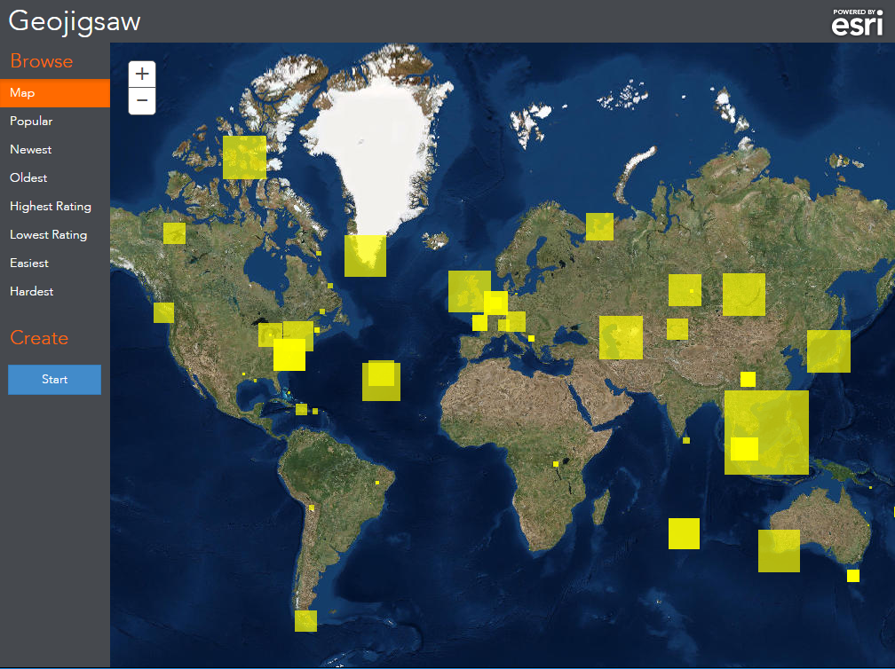

# Geojigsaw Game

GeoJigsaw is a community driven geographic jigsaw puzzle. If you are feeling creative you can create a puzzle and share it with the puzzle community. If you are feeling competitive, try beating the high score on someone else's puzzle.

Click [here](http://maps.esri.com/rc/puzzle/index.html) to use the live app.
Click [here](https://github.com/richiecarmichael/Esri-Geojigsaw) to view a simpler alternative.

### Inspiration
GeoJigsaw is a JavaScript-based web application inspired by a Silverlight application developed about two years ago called [Puzzle Map](http://blogs.esri.com/esri/apl/2012/04/11/puzzle-map-for-silverlight/).  Unlike an [another](http://blogs.esri.com/esri/apl/2014/11/17/map-quiz/) published geogame that uses Facebook, in this application we wanted to explore anonymous collaboration.  That is, anyone can anonymously create, share and play puzzles.

### Voronois
In the app developed two years ago, the puzzle design was static.  In this application we wanted to offer puzzles of varying difficulty and size so we needed to implement a technique of dynamic puzzle creation.  After a little research we discovered [this](http://bl.ocks.org/mbostock/4060366) example of a [voronoi](http://en.wikipedia.org/wiki/Voronoi_diagram) tessellation using D3.  D3′s voronoi [implementation](https://github.com/mbostock/d3/wiki/Voronoi-Geom) and associated SVG-based visualization library are the basis of this game.

Unlike the D3 sample, our app did not use completely randomized points.  If a user created or selected an “impossible” puzzle then a 10 by 10 grid of points is created and nudged slightly before being turned into 100 piece voronoi diagram using D3.  This was only part of the puzzle (excuse the pun), each piece needed the addition of one or more tabs.  Tab addition is essential to give the game its recognizable jigsaw look. Through a process of iteration, tabs are appended to any side of sufficient length and reversed if an opposing tab exists.

### SVG Filters
The finishing touch to give the puzzle a realistic look is the application of an inner bevel using a SVG filter.  SVG filters are hardware accelerated in Internet Explorer and Mozilla Firefox but not in Google Chrome.  Unfortunately the Chrome’s software rendering of SVG filters makes complex puzzles almost unplayable.  This [may](http://www.chromium.org/developers/design-documents/image-filters) change in future releases of Chrome.

### Security
Puzzles designs, ratings and scores are stored in [ArcGIS Online](http://www.arcgis.com/) (AGOL) hosted services.  We intended the application and associated services to be accessed by non-AGOL users.  This meant that AGOL user credentials could not be used to restrict access to prevent unanticipated malicious activity.  As such, we used the security model discussed in the previous post, that is, [app registration](http://doc.arcgis.com/en/arcgis-online/share-maps/add-items.htm#ESRI_SECTION1_55703F1EE9C845C3B07BBD85221FB074) and an intermediate web [proxy](https://github.com/Esri/resource-proxy).

### Libraries Used
[ArcGIS API for JavaScript](https://developers.arcgis.com/javascript/), [Bootstrap](http://getbootstrap.com/), [D3.js](http://d3js.org/), [jQuery-SmartResize](https://github.com/louisremi/jquery-smartresize), [jQuery](http://jquery.com/), [Sylvester](http://sylvester.jcoglan.com/), 

### Conclusion
This project demonstrations that modern browsers are more than capable of impressive visualizations without the need of plugins such as Silverlight or Flex.  We also wanted to experiment with anonymous game play, time will tell if the lack of user identification is an incentive or disincentive to play.  Good luck!

